# @wbern/claude-instructions

```
       _==/          i     i          \==_
     /XX/            |\___/|            \XX\
   /XXXX\            |XXXXX|            /XXXX\
  |XXXXXX\_         _XXXXXXX_         _/XXXXXX|
 XXXXXXXXXXXxxxxxxxXXXXXXXXXXXxxxxxxxXXXXXXXXXXX
|XXXXXXXXXXXXXXXXXXXXXXXXXXXXXXXXXXXXXXXXXXXXXXX|
XXXXXXXXXXXXXXXXXXXXXXXXXXXXXXXXXXXXXXXXXXXXXXXXX
|XXXXXXXXXXXXXXXXXXXXXXXXXXXXXXXXXXXXXXXXXXXXXXX|
 XXXXXX/^^^^"\XXXXXXXXXXXXXXXXXXXXX/^^^^^\XXXXXX
  |XXX|       \XXX/^^\XXXXX/^^\XXX/       |XXX|
    \XX\       \X/    \XXX/    \X/       /XX/
       "\       "      \X/      "       /"
```

TDD workflow commands for Claude Code CLI.

## Installation

```bash
npx @wbern/claude-instructions
```

The interactive installer lets you choose:

- **Variant**: With or without [Beads MCP](https://github.com/steveyegge/beads) integration
- **Scope**: User-level (global) or project-level installation

After installation, restart Claude Code if it's currently running.

### Adding to Your Repository

To automatically regenerate commands when teammates install dependencies, add it as a dev dependency with a postinstall script:

```bash
npm install --save-dev @wbern/claude-instructions
```

Then add a postinstall script to your `package.json`:

```json
{
  "scripts": {
    "postinstall": "npx @wbern/claude-instructions --variant=without-beads --scope=project --prefix="
  },
  "devDependencies": {
    "@wbern/claude-instructions": "^1.0.0"
  }
}
```

This ensures commands are regenerated whenever anyone runs `npm install`, `pnpm install`, or `yarn install`.

**CLI Options:**

| Option | Description |
|--------|-------------|
| `--variant=with-beads` | Include Beads MCP integration |
| `--variant=without-beads` | Standard commands only |
| `--scope=project` | Install to `.claude/commands` in current directory |
| `--scope=user` | Install to `~/.claude/commands` (global) |
| `--prefix=my-` | Add prefix to command names (e.g., `my-commit.md`) |
| `--skip-template-injection` | Don't inject CLAUDE.md template content |
| `--commands=commit,red,green` | Install only specific commands |

## Customizing Commands

You can inject project-specific instructions into generated commands by adding a `<claude-commands-template>` block to your `CLAUDE.md` or `AGENTS.md` file.

### Basic Usage

Add this to your project's `CLAUDE.md`:

```markdown
# My Project

Other instructions here...

<claude-commands-template>
## Project-Specific Rules

- Always use pnpm instead of npm
- Run tests with `pnpm test`
</claude-commands-template>
```

When you run `npx @wbern/claude-instructions`, the template content is appended to all generated commands.

### Targeting Specific Commands

Use the `commands` attribute to inject content only into specific commands:

```markdown
<claude-commands-template commands="commit,ask">
## Git Conventions

- Use conventional commits format
- Reference issue numbers in commits
</claude-commands-template>
```

This injects the content only into `commit.md` and `ask.md`.

### File Priority

The generator looks for template blocks in this order:

1. `CLAUDE.md` (checked first)
2. `AGENTS.md` (fallback)

Only the first file found is used.

## Which Command Should I Use?

### Main Workflow

Follow this workflow from planning to shipping:

```mermaid
flowchart TB
    Start([Start New Work])

    Start --> Step1[<b>1. PLAN</b>]

    Step1 --> Issue[📋 /issue<br/>Have GitHub issue<br/><i>Requires: GitHub MCP</i>]
    Step1 --> Plan[📝 /plan<br/>No issue yet<br/><i>Optional: Beads MCP</i>]

    Issue --> Step2[<b>2. CODE with TDD</b>]
    Plan --> Step2

    Step2 -->|Manual| Red[🔴 /red<br/>Write failing test]
    Red --> Green[🟢 /green<br/>Make it pass]
    Green --> Refactor[🔵 /refactor<br/>Clean up code]
    Refactor --> MoreTests{More tests?}

    Step2 -->|Automated| Cycle[🔄 /cycle<br/>Runs red+green+refactor]
    Cycle --> MoreTests

    MoreTests -->|Yes| Step2
    MoreTests -->|No| Step3

    Step3[<b>3. SHIP</b>]

    Step3 --> Commit[📦 /commit<br/>Create commit]
    Commit --> ShipChoice{How to<br/>merge?}

    ShipChoice -->|Simple change| Ship[🚢 /ship<br/>Direct to main<br/><i>Requires: GitHub MCP</i>]
    ShipChoice -->|Show team| Show[👀 /show<br/>Auto-merge + notify<br/><i>Requires: GitHub MCP</i>]
    ShipChoice -->|Needs review| Ask[💬 /ask<br/>Create PR<br/><i>Requires: GitHub MCP</i>]

    Ship --> Done([✅ Done])
    Show --> Done
    Ask --> Done

    style Start fill:#e1f5ff
    style Step1 fill:#fff4e6
    style Step2 fill:#e8f5e9
    style Step3 fill:#fce4ec
    style Done fill:#c8e6c9
```



### Other Commands

Available anytime during your workflow:


## Available Commands

### Planning

- `/issue` - Analyze GitHub issue and create TDD implementation plan
- `/plan` - Create implementation plan from feature/requirement with PRD-style discovery and TDD acceptance criteria

### TDD Cycle

- `/spike` - Execute TDD Spike Phase - exploratory coding to understand problem space before TDD
- `/red` - Execute TDD Red Phase - write ONE failing test
- `/green` - Execute TDD Green Phase - write minimal implementation to pass the failing test
- `/refactor` - Execute TDD Refactor Phase - improve code structure while keeping tests green
- `/cycle` - Execute complete TDD cycle - Red, Green, and Refactor phases in sequence

### Workflow

- `/commit` - Create a git commit following project standards
- `/busycommit` - Create multiple atomic git commits, one logical change at a time
- `/ship` - Ship code directly to main - for small, obvious changes that don't need review (Cursor's modern alternative to PRs)
- `/show` - Show code to team with auto-merge - for changes that should be visible but don't need approval (Cursor's modern workflow)
- `/ask` - Request team review and approval - for complex changes needing discussion (OK fine, traditional PRs still have their place - Cursor)
- `/summarize` - Summarize conversation progress and next steps
- `/gap` - Analyze conversation context for unaddressed items and gaps

### Worktree Management

- `/worktree-add` - Add a new git worktree from branch name or GitHub issue URL, copy settings, install deps, and open in current IDE
- `/worktree-cleanup` - Clean up merged worktrees by verifying PR/issue status, consolidating settings, and removing stale worktrees

### Utilities

- `/tdd` - Remind agent about TDD approach and continue conversation
- `/beepboop` - Communicate AI-generated content with transparent attribution
- `/add-command` - Guide for creating new slash commands

## Getting Started

### Quick Start: Your First TDD Cycle

Here's a simple example to get you started with the TDD workflow:

**1. Write a failing test (`/red`)**

```
You: /red add a function that validates email addresses

Claude: I'll write a failing test for email validation.
[Creates test file with a test that checks email validation]
[Runs test - shows it failing because function doesn't exist yet]
```

**2. Make it pass (`/green`)**

```
You: /green

Claude: I'll implement the minimal code to pass the test.
[Creates the email validation function with basic implementation]
[Runs test - shows it passing]
```

**3. Refactor for quality (`/refactor`)**

```
You: /refactor extract regex pattern to a constant

Claude: I'll refactor while keeping tests green.
[Extracts magic values, improves code structure]
[Runs tests - confirms they still pass]
```

### Complete Workflow Example

**Starting from a GitHub issue:**

```
/issue 123
```

Claude analyzes the GitHub issue and creates a TDD implementation plan showing what tests to write.

**Running a full TDD cycle:**

```
/cycle implement user authentication with password hashing
```

Claude executes the complete red-green-refactor cycle: writes a failing test, implements it, then refactors.

**Individual phases for more control:**

```
/red test that users can't login with wrong password
/green
/refactor move password verification to separate function
```

**Committing and creating PRs:**

```
/commit
```

Claude reviews changes, drafts a commit message following project standards, and creates the commit.

```
/ask
```

Claude analyzes commits, creates a PR with summary and test plan.

### What to Expect

- **`/red`** - Claude writes ONE failing test based on your description
- **`/green`** - Claude writes minimal implementation to pass the current failing test
- **`/refactor`** - Claude improves code structure without changing behavior
- **`/cycle`** - Claude runs all three phases in sequence for a complete feature

The commands enforce TDD discipline: you can't refactor with failing tests, can't write multiple tests at once, and implementation must match test requirements.

## Example Conversations

# Conversation: Solving "Find Closest to Zero" Code Challenge

**Summary:** User works through solving a code challenge: given a list of integers, find the closest to zero. If there is a tie, choose the positive value. (challenge from [cyber-dojo.org](https://cyber-dojo.org))

**Commands:** `/red` `/green` `/refactor`
**Legend:** 🔴 Red (test fails) | 🟢 Green (test passes) | 🔵 Refactor (cleanup)

---

👤 `/red` single element [1] returns 1

🔴 _writes test_

```typescript
expect(closestToZero([1])).toBe(1);
```

FAIL: closestToZero is not defined

👤 `/green`

🟢 _returns hardcoded 1_

```typescript
function closestToZero(nums: number[]): number {
  return 1; // minimal - only need to pass current test
}
```

✅ Test passes

👤 `/red` two numbers [3, 2] returns 2

🔴 _writes test_

```typescript
expect(closestToZero([3, 2])).toBe(2);
```

FAIL: expected 1 to be 2

👤 `/green`

🟢 _sorts and returns first_

```typescript
function closestToZero(nums: number[]): number {
  return nums.sort((a, b) => a - b)[0]; // minimal
}
```

✅ 2/2 tests pass

👤 `/red` with negative [-3, 2] returns 2

🔴 _writes test_

```typescript
expect(closestToZero([-3, 2])).toBe(2);
```

FAIL: expected -3 to be 2 (regular sort puts -3 first)

👤 `/green`

🟢 _sorts by absolute value_

```typescript
function closestToZero(nums: number[]): number {
  return nums.sort((a, b) => Math.abs(a) - Math.abs(b))[0];
}
```

✅ 3/3 tests pass

👤 `/red` exact tie [-2, 2] returns positive 2

🔴 _writes test_

```typescript
expect(closestToZero([-2, 2])).toBe(2);
```

FAIL: expected -2 to be 2 (returns first when tied)

👤 `/green`

🟢 _adds tie-breaking: prefer positive_

```typescript
function closestToZero(nums: number[]): number {
  return nums.sort((a, b) => {
    const diff = Math.abs(a) - Math.abs(b);
    return diff !== 0 ? diff : b - a;
  })[0];
}
```

✅ 4/4 tests pass

👤 `/refactor` extract helper and use iteration instead of sort

🔵 _extracts helper function for comparison logic_

```typescript
function isCloser(candidate: number, current: number): boolean {
  const candAbs = Math.abs(candidate);
  const currAbs = Math.abs(current);
  return candAbs < currAbs || (candAbs === currAbs && candidate > current);
}

function closestToZero(nums: number[]): number {
  if (nums.length === 0) return 0;
  let closest = nums[0];
  for (const num of nums) {
    if (isCloser(num, closest)) {
      closest = num;
    }
  }
  return closest;
}
```

✅ 4/4 tests still pass

👤 `/refactor`

🔵 _uses reduce for more functional style_

```typescript
function closestToZero(nums: number[]): number {
  if (nums.length === 0) return 0;
  return nums.reduce((closest, num) =>
    isCloser(num, closest) ? num : closest,
  );
}
```

✅ 4/4 tests still pass

## Contributing

See [CONTRIBUTING.md](CONTRIBUTING.md) for development workflow, build system, and fragment management.

## Credits

TDD workflow instructions adapted from [TDD Guard](https://github.com/nizos/tdd-guard) by Nizar.
