# @hevolx/agent-instructions
[_A fork of @wbern/claude-instructions_](https://github.com/wbern/claude-instructions)

[](https://www.npmjs.com/package/@hevolx/agent-instructions)
[](https://www.npmjs.com/package/@hevolx/agent-instructions)
[](https://github.com/hevolx/agent-instructions/actions/workflows/release.yml)
[](https://codecov.io/gh/hevolx/agent-instructions)
[](https://opensource.org/licenses/MIT)

[](https://claude.ai/code)
[](https://github.com/hevolx/agent-instructions/graphs/contributors)
[](https://github.com/hevolx/agent-instructions/pulls)
<!-- docs COMMANDS_BADGE -->
<!-- /docs -->

```
       _==/          i     i          \==_
     /XX/            |\___/|            \XX\
   /XXXX\            |XXXXX|            /XXXX\
  |XXXXXX\_         _XXXXXXX_         _/XXXXXX|
 XXXXXXXXXXXxxxxxxxXXXXXXXXXXXxxxxxxxXXXXXXXXXXX
|XXXXXXXXXXXXXXXXXXXXXXXXXXXXXXXXXXXXXXXXXXXXXXX|
XXXXXXXXXXXXXXXXXXXXXXXXXXXXXXXXXXXXXXXXXXXXXXXXX
|XXXXXXXXXXXXXXXXXXXXXXXXXXXXXXXXXXXXXXXXXXXXXXX|
 XXXXXX/^^^^"\XXXXXXXXXXXXXXXXXXXXX/^^^^^\XXXXXX
  |XXX|       \XXX/^^\XXXXX/^^\XXX/       |XXX|
    \XX\       \X/    \XXX/    \X/       /XX/
       "\       "      \X/      "       /"
```

**TDD workflow commands for OpenCode CLI.**

> "TDD helps you to pay attention to the right issues at the right time so you can make your designs cleaner, you can refine your designs as you learn." — Kent Beck

OpenCode supports [custom slash commands](https://opencode.ai/docs/commands/)-type `/foo` and Claude receives the contents of `foo.md` as instructions (from `.opencode/commands/` in your repo or `~/.opencode/commands/` in your home directory). This repo provides ready-made commands for Test-Driven Development workflows.

Custom commands are just a glorified copy-paste mechanism—but that simplicity is what makes them effective for establishing consistent development practices.

Instead of explaining TDD principles each session, type `/red` to write a failing test, `/green` to make it pass, `/refactor` to clean up. The commands guide Claude through each step methodically—you focus on what to build, Claude handles the how.

Want to go faster? Use `/cycle` to let Claude run the entire red-green-refactor sequence before checking in with you. For even more autonomy (your mileage may vary), `/tdd` gives Claude full discretion on when to advance between phases.

Also included are commands for commits, PRs, code reviews, and other tasks that come up during day-to-day development.

## Installation

```bash
npx @hevolx/agent-instructions    # npm
```

```bash
pnpm dlx @hevolx/agent-instructions   # pnpm
```

The interactive installer lets you choose:

- **Feature flags**: Enable optional integrations like [Beads MCP](https://github.com/steveyegge/beads)
- **Scope**: User-level (global) or project-level installation

After installation, restart OpenCode if it's currently running.

### Adding to Your Repository

To automatically regenerate commands when teammates install dependencies, add it as a dev dependency with a postinstall script:

```bash
npm install --save-dev @hevolx/agent-instructions
```

Then add a postinstall script to your `package.json`:

```json
{
  "scripts": {
    "postinstall": "agent-instructions --scope=project --overwrite"
  },
  "devDependencies": {
    "@hevolx/agent-instructions": "^<!-- docs VERSION --><!-- /docs -->"
  }
}
```

This ensures commands are regenerated whenever anyone runs `npm install`, `pnpm install`, or `yarn install`.

**CLI Options:**

<!-- docs CLI_OPTIONS -->
<!-- /docs -->

## Customizing Commands

You can inject project-specific instructions into generated commands by adding a `<agent-commands-template>` block to your `AGENT.md` file.

### Basic Usage

Add this to your project's `AGENT.md`:

```markdown
# My Project

Other instructions here...

<agent-commands-template>
## Project-Specific Rules

- Always use pnpm instead of npm
- Run tests with `pnpm test`
</agent-commands-template>
```

When you run `agent-instructions`, the template content is appended to all generated commands.

### Targeting Specific Commands

Use the `commands` attribute to inject content only into specific commands:

```markdown
<agent-commands-template commands="commit,ask">
## Git Conventions

- Use conventional commits format
- Reference issue numbers in commits
</agent-commands-template>
```

This injects the content only into `commit.md` and `ask.md`.

## Which Command Should I Use?

### Main Workflow

This is the core TDD workflow. Additional utility commands (worktrees, spikes, etc.) are listed in [Available Commands](#available-commands) below.

```mermaid
flowchart TB
    Start([Start New Work])

    Start --> Step1[<b>1. PLAN</b>]

    Step1 --> Issue[📋 /issue<br/>Have GitHub issue<br/><i>Requires: GitHub MCP</i>]
    Step1 --> CreateIssues[📝 /create-issues<br/>No issue yet<br/><i>Optional: Beads MCP</i>]

    Issue --> Step2[<b>2. CODE with TDD</b>]
    CreateIssues --> Step2

    Step2 -->|Manual| Red[🔴 /red<br/>Write failing test]
    Red --> Green[🟢 /green<br/>Make it pass]
    Green --> Refactor[🔵 /refactor<br/>Clean up code]
    Refactor --> MoreTests{More tests?}

    Step2 -->|Automated| Cycle[🔄 /cycle<br/>Runs red+green+refactor]
    Cycle --> MoreTests

    MoreTests -->|Yes| Step2
    MoreTests -->|No| Step3

    Step3[<b>3. SHIP</b>]

    Step3 --> Commit[📦 /commit<br/>Create commit]
    Commit --> ShipChoice{How to<br/>merge?}

    ShipChoice -->|Simple change| Ship[🚢 /ship<br/>Direct to main<br/><i>Requires: GitHub MCP</i>]
    ShipChoice -->|Show team| Show[👀 /show<br/>Auto-merge + notify<br/><i>Requires: GitHub MCP</i>]
    ShipChoice -->|Needs review| Ask[💬 /ask<br/>Create PR<br/><i>Requires: GitHub MCP</i>]

    Ship --> Done([✅ Done])
    Show --> Done
    Ask --> Done
```



## Available Commands

<!-- docs COMMANDS_LIST -->
<!-- /docs -->

## Getting Started

### Quick Start: Your First TDD Cycle

Here's a simple example to get you started with the TDD workflow:

**1. Write a failing test (`/red`)**

```
You: /red add a function that validates email addresses

Claude: I'll write a failing test for email validation.
[Creates test file with a test that checks email validation]
[Runs test - shows it failing because function doesn't exist yet]
```

**2. Make it pass (`/green`)**

```
You: /green

Claude: I'll implement the minimal code to pass the test.
[Creates the email validation function with basic implementation]
[Runs test - shows it passing]
```

**3. Refactor for quality (`/refactor`)**

```
You: /refactor extract regex pattern to a constant

Claude: I'll refactor while keeping tests green.
[Extracts magic values, improves code structure]
[Runs tests - confirms they still pass]
```

### Complete Workflow Example

**Starting from a GitHub issue:**

```
/issue 123
```

Claude analyzes the GitHub issue and creates a TDD implementation plan showing what tests to write.

**Running a full TDD cycle:**

```
/cycle implement user authentication with password hashing
```

Claude executes the complete red-green-refactor cycle: writes a failing test, implements it, then refactors.

**Individual phases for more control:**

```
/red test that users can't login with wrong password
/green
/refactor move password verification to separate function
```

**Committing and creating PRs:**

```
/commit
```

Claude reviews changes, drafts a commit message following project standards, and creates the commit.

```
/ask
```

Claude analyzes commits, creates a PR with summary and test plan.

### What to Expect

- **`/red`** - Claude writes ONE failing test based on your description
- **`/green`** - Claude writes minimal implementation to pass the current failing test
- **`/refactor`** - Claude improves code structure without changing behavior
- **`/cycle`** - Claude runs all three phases in sequence for a complete feature

The commands enforce TDD discipline: you can't refactor with failing tests, can't write multiple tests at once, and implementation must match test requirements.

## Example Conversations

<!-- docs EXAMPLE_CONVERSATIONS -->
<!-- /docs -->

## Contributing

See [CONTRIBUTING.md](CONTRIBUTING.md) for development workflow, build system, and fragment management.

## Credits

TDD workflow instructions adapted from [TDD Guard](https://github.com/nizos/tdd-guard) by Nizar.

FIRST principles and test quality criteria from [TDD Manifesto](https://tddmanifesto.com/).

Example kata from [Cyber-Dojo](https://cyber-dojo.org/).

## Related Projects

- [citypaul/.dotfiles](https://github.com/citypaul/.dotfiles) - Claude Code configuration with TDD workflows and custom commands
- [nizos/tdd-guard](https://github.com/nizos/tdd-guard) - Original TDD Guard instructions for Claude
